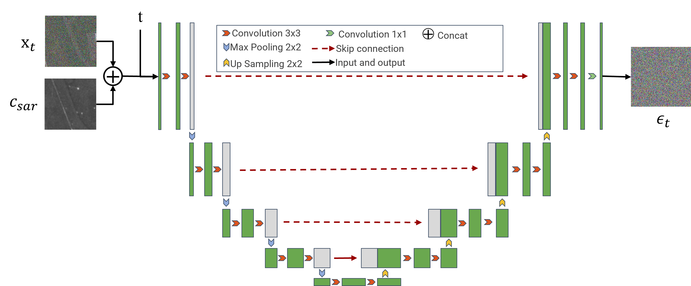

# Conditional Diffusion for SAR to Optical Image Translation

This is the official implementation of [Conditional Diffusion for SAR to Optical Image Translation](..)

This repository is based on [guided diffusion](https://github.com/openai/guided-diffusion) with modifications.

# Overview

## Abstract

*Synthetic Aperture Radar (SAR) offers all-weather and all-day high-resolution imaging, yet its unique imaging mechanism often necessitates expert interpretation, limiting its broader applicability. Addressing this challenge, this paper proposes a generative model that bridges SAR and optical imaging, facilitating the conversion of SAR images into more human-recognizable optical aerial images. This assists in the interpretation of SAR data, making it easier to recognize. Specifically, our model backbone is based on the recent diffusion models, which have powerful generative capabilities. We have innovatively tailored the diffusion model framework, incorporating SAR images as conditional constraints in the sampling process. This adaptation enables the effective translation from SAR to optical images.We conduct experiments on the satellite GF3 and SEN12 datasets and use Structural Similarity (SSIM) and Fréchet Inception Distance (FID) for quantitative evaluation.The results show that our model not only surpasses previous methods in quantitative evaluation but also significantly improves the visual quality of the generated images. This advancement underscores the model's potential to enhance SAR image interpretation.*

## Model Structure

Base architecture is a U-net network. Our key idea is to leverage SAR images to guide the inference process of the model. It should be noted that the SAR image condition at each diffusion step is **noise-free**, which is done to give the model more precise and consistent guidance.

## Train

First set:

```shell
export OPENAI_LOGDIR=/dirs/to/log
```

Considering the accessibility of data set, we give the hyperparameters for training SEN-12 data set.

```sh
MODEL_FLAGS="--image_size 256 --num_channels 128 --num_res_blocks 3 --learn_sigma False"
DIFFUSION_FLAGS="--diffusion_steps 2000 --noise_schedule linear"
TRAIN_FLAGS="--lr 1e-4 --batch_size 6"
```

Run:

```sh
mpiexec -n 4 python scripts/image_train.py --data_dir_sar /PATH/to/SAR/images --data_dir_opt /Path/to/opt/images  $MODEL_FLAGS $DIFFUSION_FLAGS $TRAIN_FLAGS
```

You can also run the `train.sh`:

```shell
bash train.sh
```

Model will be found in `OPENAI_LOGDIR`.🥳

## Sample

First set:

```shell
export OPENAI_LOGDIR=/dirs/to/save/results
```

Set `SAMPLE_FLAGS` and use the same config with train:

```shell
MODEL_FLAGS="--image_size 256 --num_channels 128 --num_res_blocks 3 --learn_sigma False" 
DIFFUSION_FLAGS="--diffusion_steps 2000 --noise_schedule linear" 
SAMPLE_FLAGS="--batch_size 8 --num_samples 100 --timestep_respacing 250"
```

**Note: **`num_samples` is the maximum number of images you want to sample and `timestep_respacing` is the actual number of sampling steps.

And then, set  test SAR images and GT opt path in `image_sample_realtime.py`:

```python
pair_datas = pair_Dataset('/PATH/to/test/images',...)
```

Run:

```shell
python scripts/image_sample_realtime.py --model_path /Path/to/checkpoints $MODEL_FLAGS $DIFFUSION_FLAGS $SAMPLE_FLAGS
```

Or you can run:

```shell
bash sample.sh
```

You will find tanslate results in `OPENAI_LOGDIR`. 🌠

## Cite

